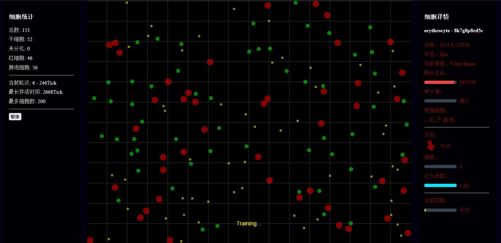

# 深度学习 & 细胞生命游戏

> 由深度学习完成的零玩家游戏

*未完成*

## 依赖

### 前端

`pnpm install`: 自动安装

### Python

+ `pip install -r requirements.txt`: 自动安装
+ `pip freeze > requirements.txt`: 自动生成依赖文件

## TODO list

### 未完成

+ 调整模型结构，使训练更有效果
+ 引入负面细胞（病毒细菌等）
+ 用户控制细胞支持
+ UI调整，细胞贴图优化

### 已完成

+ 基本细胞绘制（pixi）
+ 细胞动画
+ 细胞分类行为设定（随机数模拟决策）
+ 神经网络决策
+ WebSocket 通信机制（实施决策、反馈训练）
